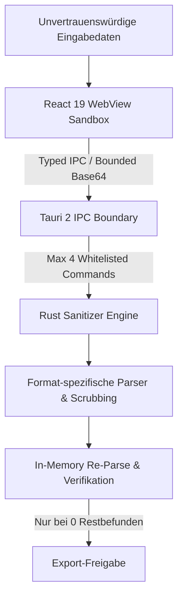

<div align="center">

```
███╗   ██╗██╗   ██╗██╗     ██╗     ███╗   ███╗ █████╗ ██████╗ ██╗  ██╗
████╗  ██║██║   ██║██║     ██║     ████╗ ████║██╔══██╗██╔══██╗██║ ██╔╝
██╔██╗ ██║██║   ██║██║     ██║     ██╔████╔██║███████║██████╔╝█████╔╝
██║╚██╗██║██║   ██║██║     ██║     ██║╚██╔╝██║██╔══██║██╔══██╗██╔═██╗
██║ ╚████║╚██████╔╝███████╗███████╗██║ ╚═╝ ██║██║  ██║██║  ██║██║  ██╗
╚═╝  ╚═══╝ ╚═════╝ ╚══════╝╚══════╝╚═╝     ╚═╝╚═╝  ╚═╝╚═╝  ╚═╝╚═╝  ╚═╝
```

# VGT NullMark
### Invisible Watermark Detection & Privacy Sanitizer

[](https://opensource.org/licenses/MIT)
[](#)
[](#)
[](#-requirements)
[](https://tauri.app)
[](https://www.rust-lang.org)
[](https://react.dev)
[](#-supported-formats)
[](#-security-architecture)
[](#-supported-formats)
[](#-unicode-sanitization-modes)
[](https://visiongaiatechnology.de)

**LOCAL-FIRST · ZERO NETWORK · INVISIBLE UNICODE DETECTION · METADATA SCRUBBING · C2PA REMOVAL · RE-PARSE VERIFICATION**

</div>

---

## ⚠️ BETA SOFTWARE — NOT INDEPENDENTLY AUDITED

VGT NullMark 1.0.0-beta.2 is a functional beta. It has **not** received an independent cryptographic or security audit.

NullMark reports only **deterministic, explicitly implemented, auditable rules**. It never converts an unknown vendor state into a false `verified clean` claim. Statistical watermarks (e.g. SynthID) are explicitly declared as `not-verifiable-without-vendor-detector`.

Found a vulnerability or have an improvement? **Open an issue or contact us.**

---


## 🔍 What is VGT NullMark?

NullMark is a hardened, local-first desktop application for detection, analysis and deterministic sanitization of invisible Unicode watermarks, tracker payloads, sensitive metadata and active provenance manifests (C2PA) from texts, images and documents.

```
Conventional privacy tools:
  Cloud-based processing         → your data leaves the device
  Single-pass sanitization       → no verification of result
  No C2PA awareness              → AI provenance manifests survive
  No re-parse step               → residual markers go undetected
  False "100% clean" claims      → statistical watermarks ignored

VGT NullMark:
  100% local processing          → zero network access, zero telemetry
  3 sanitization modes           → Safe · Strict · Maximum
  9 file formats                 → PNG, JPEG, WebP, PDF, SVG, DOCX, XLSX, PPTX, ODT
  C2PA manifest removal          → caBX, APP11, RIFF, ZIP manifests
  Re-parse verification          → every result independently re-analyzed before export
  Honest scope declaration       → statistical signals declared, never falsely confirmed
  Rust core, no unsafe code      → #![forbid(unsafe_code)]
  4 whitelisted IPC commands     → no shell, no fs plugin, no HTTP plugin
```

---


## 🏛️ Architecture



```
┌─────────────────────────────────────────────────────────┐
│              REACT 19 / TYPESCRIPT UI                    │
│   Text Workspace · Document Workspace · Split Diff       │
│   DE / EN · Risk Color Coding · Codepoint Inspector      │
├─────────────────────────────────────────────────────────┤
│              TAURI 2 IPC BOUNDARY                        │
│   4 commands only · Bounded Base64 · No file paths      │
│   withGlobalTauri: false · freezePrototype: true         │
├─────────────────────────────────────────────────────────┤
│              RUST SANITIZER ENGINE                        │
│   #![forbid(unsafe_code)] · Edition 2021                 │
│                                                         │
│  ┌──────────┬──────────┬──────────┬────────────────┐   │
│  │  Unicode │  Binary  │   PDF    │  Office / ODT  │   │
│  │  Engine  │  Parser  │  Engine  │  ZIP Engine    │   │
│  │  3 modes │PNG/JPEG  │  lopdf   │  DOCX/XLSX     │   │
│  │          │WebP/SVG  │          │  PPTX/ODT      │   │
│  └──────────┴──────────┴──────────┴────────────────┘   │
│                                                         │
│              IN-MEMORY RE-PARSE & VERIFY                 │
│        Export blocked until 0 residual findings          │
└─────────────────────────────────────────────────────────┘
```

---

## 🛡️ Security Architecture

### Least-Privilege IPC — 4 Commands Only

```
analyze_text(text: String)
sanitize_text(text: String, mode: String)
analyze_binary(payload_base64: String)
sanitize_binary(payload_base64: String)
```

No native file paths cross the IPC boundary. Only bounded bytes.

### Disabled by Default

| Plugin | Status |
|---|---|
| `plugin-fs` (Filesystem) | ❌ Disabled |
| `plugin-shell` (Shell execution) | ❌ Disabled |
| `plugin-http` (HTTP networking) | ❌ Disabled |
| `plugin-opener` / `plugin-process` | ❌ Disabled |

### Hardening Checklist

| Control | Status |
|---|---|
| `#![forbid(unsafe_code)]` in Rust core | ✅ |
| `withGlobalTauri: false` | ✅ |
| `freezePrototype: true` | ✅ |
| No `dangerouslySetInnerHTML` | ✅ |
| No `eval()` / `new Function()` | ✅ |
| Strict CSP — `default-src 'none'` | ✅ |
| No remote scripts, fonts, CDNs | ✅ |
| No runtime command execution in network-facing services | ✅ |
| SHA-256 input/output fingerprints | ✅ |
| Automatic post-sanitization re-parse | ✅ |
| Source security gate (`npm run security:check`) | ✅ |

**CSP:**
```
default-src 'none'; connect-src ipc: http://ipc.localhost;
font-src 'self'; img-src 'self' data:; style-src 'self';
script-src 'self'; object-src 'none'; frame-src 'none'
```

Run the security gate at any time:
```bash
npm run security:check
```

---

## 📦 Supported Formats

NullMark processes **9 file formats** with native magic-byte signature verification.

| Category | Format | Metadata Removed | C2PA |
|---|---|---|---|
| **Text** | TXT, MD, CSV, JSON, XML, YAML, HTML | Unicode payloads (plaintext extraction) | — |
| **Raster Images** | PNG | `tEXt`, `zTXt`, `iTXt`, `eXIf`, `tIME` chunks — strict CRC32 validation | `caBX` chunks |
| **Raster Images** | JPEG | EXIF (`0xE1`), XMP, IPTC/Photoshop (`0xED`), App segments, Comments — entropy scan after SOS, EOI validation | APP11 (`0xEB`) fragment chains |
| **Raster Images** | WebP | `EXIF`, `XMP` RIFF chunks — VP8X flag bitmask scrubbing, RIFF size correction | `C2PA` RIFF chunk |
| **Documents** | PDF | `/Info` dict, `/Metadata` XMP (doc + page), annotation identity fields (`/T`, `/M`, `/CreationDate`, `/NM`), `/JavaScript`, `/Launch`, `/OpenAction`, `/AA` | `AFRelationship /C2PA_Manifest` filespecs |
| **Vector** | SVG | `<metadata>`, XML comments, `<script>`, event attributes (`onclick` etc.), external URIs — Doctype discarded (XXE protection) | `c2pa:manifest` |
| **Office** | DOCX | `docProps/core.xml`, `custom.xml`, `app.xml`, `w:author`, `w:date`, `w:initials` — Unicode scrubbing in `word/document.xml` | `META-INF/content_credential.c2pa` |
| **Office** | XLSX | `docProps/`, `xl/comments*.xml`, `xl/persons/person*.xml` — Unicode scrubbing in `xl/sharedStrings.xml` | `META-INF/content_credential.c2pa` |
| **Office** | PPTX | `docProps/`, `ppt/commentAuthors.xml`, `ppt/authors.xml` — Unicode scrubbing in all `ppt/slides/slide*.xml` | `META-INF/content_credential.c2pa` |
| **OpenDocument** | ODT | `meta.xml`, `manifest.rdf` — canonical `mimetype` as uncompressed entry 0 verified | `META-INF/content_credential.c2pa` |

---

## 🔤 Unicode Sanitization Modes

```
Input Codepoints
       │
       ├─► Safe     → Zero-width spaces, BOM, Tag chars, Soft hyphens
       │             (context-sensitive chars reported but kept)
       │
       ├─► Strict   → + Bidi controls/overrides/isolates, ZWJ/ZWNJ,
       │               Invisible math operators, Unusual spaces → ASCII space
       │
       └─► Maximum  → + Private-use area (PUA), Curly quotes → straight,
                       Dash variants → hyphen, Ellipsis → ...,
                       Fullwidth ASCII → standard ASCII
```

### Unicode Rule Matrix

| Codepoint | Name | Mode | Safe | Strict | Max |
|---|---|---|:---:|:---:|:---:|
| `U+200B` | Zero Width Space | Zero-width / High | 🗑️ | 🗑️ | 🗑️ |
| `U+FEFF` | BOM / Zero Width No-Break | Zero-width / High | 🗑️ | 🗑️ | 🗑️ |
| `U+2060` | Word Joiner | Zero-width / Medium | 🗑️ | 🗑️ | 🗑️ |
| `U+00AD` | Soft Hyphen | Invisible format / Medium | 🗑️ | 🗑️ | 🗑️ |
| `U+E0000..E007F` | Unicode Tag Characters | Tag / High | 🗑️ | 🗑️ | 🗑️ |
| `U+200C`, `U+200D` | ZWNJ / ZWJ | Zero-width / Medium | ✅ Keep | 🗑️ | 🗑️ |
| `U+202A..202E` | Bidi Embeddings / Overrides | Bidi / High | ✅ Keep | 🗑️ | 🗑️ |
| `U+2061..2064` | Invisible Math Operators | Invisible / Medium | ✅ Keep | 🗑️ | 🗑️ |
| `U+00A0`, `U+2000..200A` | Non-Standard Spaces | Suspicious / Info | ✅ Keep | 🔄 → ` ` | 🔄 → ` ` |
| `U+E000..F8FF` | Private Use Area (PUA) | PUA / High | ✅ Keep | ✅ Keep | 🗑️ |
| `U+2018..201D` | Typographic Quotes | Surface / Info | ✅ Keep | ✅ Keep | 🔄 → `'` `"` |
| `U+2010..2015`, `U+2212` | Dash variants / Minus | Surface / Info | ✅ Keep | ✅ Keep | 🔄 → `-` |
| `U+FF01..FF5E` | Fullwidth ASCII | Compat / Low | ✅ Keep | ✅ Keep | 🔄 → ASCII |

---

## ✅ Verification Guarantee

After every sanitization pass, NullMark **re-parses the result entirely in memory**.

```
Sanitize(input)
    │
    ▼
In-memory re-parse
    │
    ├─ 0 residual findings → Export unlocked ✅
    └─ Any finding remains → Export blocked ❌
```

**Canonical idempotence:** `sanitize(sanitize(x)) == sanitize(x)` with 0 residual findings.

Every operation produces:
- SHA-256 fingerprint of input
- SHA-256 fingerprint of sanitized output
- Change ledger (max. 4,096 recorded operations)

---

## 🤖 AI Watermark Scope — Honest Declaration

| Vendor / Method | NullMark Coverage |
|---|---|
| **Explicit Unicode payloads** | ✅ Detected and removed (all modes) |
| **C2PA provenance manifests** | ✅ Removed across all 9 formats |
| **Document & image metadata** | ✅ Removed |
| **Google SynthID Text** | ⚠️ Probabilistic token-sampling — no hidden Unicode. NullMark cannot prove removal without vendor detector. |
| **OpenAI text watermarks** | ⚠️ Research-stage, not universally deployed. Maximum mode canonicalizes token surface but makes no statistical guarantee. |
| **Anthropic / Claude** | ⚠️ No official public text-watermark specification found at Beta 1.0 research pass. |

> NullMark **never** outputs a false `verified clean` claim for statistical watermarks. Unknown vendor state is declared `not-verifiable-without-vendor-detector`.

---

## ⚙️ Resource Limits

| Parameter | Limit | Protection |
|---|---|---|
| **Max text input** | 8 MiB | UI freeze / string overflow prevention |
| **Max file size (single)** | 32 MiB | Bounded IPC memory |
| **Max batch volume** | 128 MiB / 50 files | Host memory exhaustion |
| **ZIP decompression ceiling** | 128 MiB expanded / 4,096 entries | Zip bomb / recursion protection |
| **PDF objects / stream buffer** | 100,000 objects / 128 MiB | PDF object flood protection |
| **Finding aggregation** | Max 8 positions per codepoint | O(1) memory on marker-flooded files |
| **Diff change ledger** | Max 4,096 operations | Render pipeline protection |

---

## 🖥️ Desktop Interface

| Workspace | Purpose |
|---|---|
| **Text & Unicode** | Direct text input / text files — Split Diff viewer, per-step change log, 1-click mode escalation |
| **Documents & Media** | Batch processing — up to 50 files, sequential verification, secure download |

**Internationalization:** German and English (stored in `localStorage`).

**Visual inspection:** Risk color coding (High · Medium · Low · Info), codepoint display as `U+XXXX`, match counter and position display.

---

## ⚙️ Tech Stack

| Component | Technology | Version |
|---|---|---|
| **Native Core** | Rust / Tauri 2 | Edition 2021, MSRV 1.88+ · Tauri v2.11.5 |
| **UI** | React, TypeScript, Vite | React 19 · TS 5.8 · Vite 8 |
| **XML / Streaming Parser** | `quick-xml` | v0.41.0 |
| **PDF Engine** | `lopdf` (zero-default-features) | v0.44.0 |
| **ZIP Engine** | `zip` (deflate) | v8.6.0 |
| **Cryptographic Hashes** | `sha2` (SHA-256) | v0.10.9 |
| **Checksums** | `crc32fast` | v1.5.0 |

---

## 📋 Requirements

| Platform | Requirement |
|---|---|
| **Windows** | Windows 10 / 11 x64 — Microsoft WebView2 Runtime, VC++ Redistributable |
| **macOS** | macOS 12+ — Apple Silicon or Intel x64 |
| **Linux** | x86_64 / aarch64 — WebKitGTK 4.1+ |
| **Rust** | 1.95 or newer with Cargo |
| **Node.js** | 20.19+ or 22.12+ (required by Vite 8) |
| **Disk** | ~3 GiB for first build and dependencies |

---

## 🚀 Build & Run

### Windows

```cmd
START_WINDOWS.cmd
```

Or manually:

```cmd
npm ci --ignore-scripts
npm run security:check
npm run tauri:dev
```

Build installers (NSIS `.exe` + WiX `.msi`):

```cmd
BUILD_WINDOWS.cmd
```

Artifacts land in `src-tauri/target/release/bundle/`.

### macOS / Linux

```bash
npm install
npm run security:check
npm run tauri:dev
```

Build:

```bash
npm run tauri:build
```

### Test Engine Core (without Tauri)

`src-tauri/src/engine.rs` has no external dependencies — test the sanitizer core standalone:

```bash
rustc --edition 2021 --test src-tauri/src/engine.rs -o nullmark-engine-tests
./nullmark-engine-tests
```

On Windows: `TEST_ENGINE.cmd`

---

## 🗂️ Project Layout

```
src/                              React/TypeScript renderer
  App.tsx                         Main UI
  lib/backend.ts                  Typed IPC boundary
src-tauri/
  src/engine.rs                   Engine boundary and invariants
  src/engine/                     Rules, model and sanitizer policies
  src-tauri/src/binary/           PNG/JPEG/WebP/PDF/SVG/Office/ODF parsers
  src/lib.rs                      Bounded Tauri command layer + verification
  permissions/                    Explicit custom-command permissions
  capabilities/                   Single-window least-privilege capability
  tauri.conf.json                 CSP and desktop configuration
scripts/security-check.mjs        Source/config security gate
docs/                             Architecture and threat model
ROADMAP.md                        Versioned future work and acceptance gates
.github/                          CI, Dependabot and PR policy
```

---

## 📚 Documentation

| Document | Link |
|---|---|
| Technical Data Sheet | [`docs/TECHNICAL_DATASHEET.md`](docs/TECHNICAL_DATASHEET.md) |
| Binary Format Specification | [`docs/FORMAT_SPECIFICATION.md`](docs/FORMAT_SPECIFICATION.md) |
| Threat Model | [`docs/THREAT_MODEL.md`](docs/THREAT_MODEL.md) |
| Security Audit Report | [`docs/SECURITY_AUDIT.md`](docs/SECURITY_AUDIT.md) |
| Watermark Research | [`docs/WATERMARK_RESEARCH.md`](docs/WATERMARK_RESEARCH.md) |
| Reproducibility Guide | [`docs/REPRODUCIBILITY.md`](docs/REPRODUCIBILITY.md) |
| Benchmark Results | [`docs/BENCHMARK_RESULTS.md`](docs/BENCHMARK_RESULTS.md) |
| Roadmap | [`ROADMAP.md`](ROADMAP.md) |

---

## 🚧 Known Limitations (Beta 1.0)

- Regular PDF attachments preserved — JavaScript/launch/automatic actions removed, unrelated embedded files not silently deleted
- Office transformations target metadata and supported authorship fields — macros and arbitrary embedded objects not processed
- Statistical AI watermarks (SynthID etc.) not provably removable — declared honestly, never falsely confirmed
- Container metadata reveals: original filename, size, creation time, suite, algorithms, public-key hashes, offline factor presence

---

## 🗺️ Roadmap — Beta 2

| Feature | Status |
|---|---|
| Exact split diff and bounded change ledger | 🔜 Beta 2 |
| XLSX / PPTX / SVG support | ✅ Done (beta.2) |
| Deeper PDF object inspection | 🔜 Beta 2 |
| German / English interface catalogs | ✅ Done (beta.2) |
| Restrained desktop UI with project-owned SVG identity | 🔜 Beta 2 |

---

## 🔗 VGT Ecosystem

| Tool | Type | Purpose |
|---|---|---|
| 🧹 **VGT NullMark** | **Privacy Sanitizer** | Watermark detection and metadata scrubbing — you are here |
| 🧠 **[VGT AETHEL](https://github.com/visiongaiatechnology/aethel)** | **Sovereign AI OS** | Local AI intelligence OS with operator governance |
| 🛡️ **[VGT GeDefense](https://github.com/visiongaiatechnology/gedefense)** | **Linux Security Fabric** | Kernel-near defense, XDR, encrypted evidence |
| 🔑 **[VGT Infinity](https://github.com/visiongaiatechnology/vgt-infinity)** | **PQ File Encryption** | Post-quantum file vault |
| ⚔️ **[VGT Sentinel](https://github.com/visiongaiatechnology/sentinelcom)** | **WAF / IDS** | Zero-Trust WordPress WAF |
| ⚡ **[VGT Auto-Punisher](https://github.com/visiongaiatechnology/vgt-auto-punisher)** | **IDS** | L4+L7 Hybrid IDS |
| 🌐 **[GaiaCom](https://github.com/visiongaiatechnology/GaiaCom)** | **Communication** | Post-quantum federated E2EE platform |
| 📊 **[VGT Dattrack](https://github.com/visiongaiatechnology/dattrack)** | **Analytics** | Sovereign local analytics |

---

## 💙 Support the Mission

[](https://paypal.me/dergoldenelotus)

| Method | Address |
|---|---|
| **PayPal** | [paypal.me/dergoldenelotus](https://paypal.me/dergoldenelotus) |
| **Bitcoin** | `bc1q3ue5gq822tddmkdrek79adlkm36fatat3lz0dm` |
| **ETH / USDT (ERC-20)** | `0xD37DEfb09e07bD775EaaE9ccDaFE3a5b2348Fe85` |

---

## 📄 License

**AGPLv3 · © 2026 VisionGaia Technology · Cologne, Germany**

Enterprise deployments, TIER-0 audits (VGT SafetySys™) and commercial support: [visiongaiatechnology.de](https://visiongaiatechnology.de)

---

<div align="center">

**VISIONGAIATECHNOLOGY – WE ARCHITECT THE FUTURE OF SECURITY.**

[](https://visiongaiatechnology.de)

*VGT NullMark 1.0.0-beta.2 — Invisible Unicode Detection · C2PA Removal · Metadata Scrubbing · 9 File Formats · Safe/Strict/Maximum Modes · Re-Parse Verification · Rust/Tauri 2 · Zero Network · Local-First · AGPLv3 · Windows / macOS / Linux*

</div>
